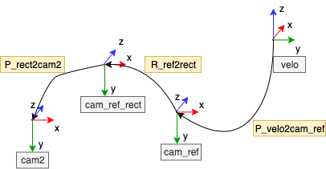

# lidar to camera calibration with KITTI dataset

## Index
1. [Dataset](#dataset)
2. [Usage](#usage)

## Dataset

1. Visit [KITTI dataset website](https://www.cvlibs.net/datasets/kitti/raw_data.php) and login
2. Download object tracking or any sequence dataset (Recommend Raw data tab)

### Dataset tree
```text
kitti_lidar_to_camera_calibration
├─ data
│  └─ kitti_sequence05
│     ├─ image_00
│     │  ├─ data
│     │  │  ├─ 0000000000.png
│     │  │  └─ ...
│     │  └─ timestamps.txt
│     ├─ image_01
│     │  ├─ data
│     │  │  ├─ 0000000000.png
│     │  │  └─ ...
│     │  └─ timestamps.txt
│     ├─ image_02
│     │  ├─ data
│     │  │  ├─ 0000000000.png
│     │  │  └─ ...
│     │  └─ timestamps.txt
│     ├─ image_03
│     │  ├─ data
│     │  │  ├─ 0000000000.png
│     │  │  └─ ...
│     │  └─ timestamps.txt
│     ├─ label_02
│     │  ├─ 0000.txt
│     │  └─ ...
│     ├─ oxts
│     │  ├─ data
│     │  │  ├─ 0000000000.txt
│     │  │  └─ ...
│     │  ├─ dataformat.txt
│     │  └─ timestamps.txt
│     └─ velodyne_points
│        ├─ data
│        │  ├─ 0000000000.bin
│        │  └─ ...
│        ├─ timestamps.txt
│        ├─ timestamps_end.txt
│        └─ timestamps_start.txt
├─ src
│  ├─ ...
│  └─ main.py
└─ ...
```

## Usage

```bash
python3 main.py
```


## Calibration file information

```
S_xx: 1x2 size of image xx before rectification
K_xx: 3x3 calibration matrix of camera xx before rectification
D_xx: 1x5 distortion vector of camera xx before rectification
R_xx: 3x3 rotation matrix of camera xx (extrinsic)
T_xx: 3x1 translation vector of camera xx (extrinsic)
S_rect_xx: 1x2 size of image xx after rectification
R_rect_xx: 3x3 rectifying rotation to make image planes co-planar
P_rect_xx: 3x4 projection matrix after rectification
```

<div style="text-align:center"></div>

<!--  -->

$$
Y = \text{P\_rect\_xx} * \text{R\_rect\_00} * (R|T)\text{\_velo\_to\_cam} * X
$$